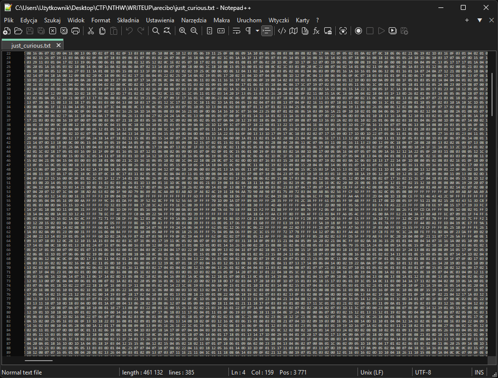

# arecibo
[zadanie_arecibo.txt](./assets/zadanie_arecibo.txt)

```txt
Wiadomość Arecibo została wysłana 16 listopada 1974, celem pozyskania kontaktu z obcymi cywilizacjami. Do tej pory niczym goniec zmierza ku gromadzie herkulesa niosąc najważniejsze informacje o ludzkości w postaci monochromatycznego obrazka. Jako, że wiadomość została nadana radiowo wartości kolejnych pikseli wysyłane były kolejno po sobie. Tracąc w ten sposób informacje o jego oryginalnym rozmiarze. Naukowcy z Uniwersytetu Cornella przekonani, że matematyka jest językiem wszechświata sprytnie ukryli rozmiar oryginalnego obrazka w długości wysłanej wiadomości, która wynosiła 1679. Natura tej liczby ogranicza możliwości zorganizowania pikseli w prostokąt do dwóch kombinacji.

Czy jako obcy byłbyś w stanie poprawnie odczytać obraz wysłany w ten sposób?
```

Na początek mały research który doprowadził mnie do informacji o wiadomości Arecibo na wikipedii (https://pl.wikipedia.org/wiki/Wiadomo%C5%9B%C4%87_Arecibo).

Wiadomość miała rozmiar 73 wiersze po 23 bajty w wierszu (73x23=1679). U nas jest zdecydowanie zbyt dużo danych aby obraz był tej wielkości. Na początek usunąłem wszystko co nie jest danymi i zapisałem jako nowy plik `message.txt`. Po uruchomieniu komendy `cat message.txt | wc` dowiedziałem się, że wiadomość składa się z:

- 1 linii
- 153583 słów
- 460749 znaków

Na podstawie wcześniejszego reasearchu i opisu zadania z którego wynikało, że długość wiadomości jest na tyle charakterystyczna że można ją zdekodować tylko na w sposoby, zauważyłem że 153583 również ma tylko 2 czynniki pierwsze. Po wpisaniu w terminalu `python3` i uruchomieniu się interaktywnej konsoli Pythona można to szybko sprawdzić wpisując:
```
>>> from sympy import factorint
>>> factorint(153583)
{383: 1, 401: 1}
>>>
```
>*(">>>" to znak zachęty konsoli, tego nie należy wpisywać)*

Postanowiłem sprawdzić czy przypadkiem słowa które zawierają się na wiadomość w pliku `message.txt` to nie są wartości poszczególnych pixeli pliku graficznego który tak na prawdę jest nasza wiadomością. Nie odrazu powstał dobry czytelny obraz. Ale już podczas pierwszych prób było widać, że to prawidłowy kierunek.  


Mamy więc dokładnie 8 bitów aby zakodować każdy pixel i wymiary szerokość 401 i wysokość 383.

```python
from PIL import Image

def read_data_from_file(filename):
    with open(filename, 'r') as file:
        hex_values = file.read().strip().split()
    return [int(value, 16) for value in hex_values]

def create_image(data, width, height, output_filename):
    required_size = width * height
    if len(data) < required_size:
        data += [0] * (required_size - len(data))

    img = Image.new('L', (width, height)) # 'L' 8-bit grayscale

    img.putdata(data[:required_size])
    img.save(output_filename)

if __name__ == "__main__":
    # Configuration
    input_file = 'message.txt'
    width = 401
    height = 383

    # Read data
    pixel_data = read_data_from_file(input_file)
    # Create 8-bit grayscale BMP image
    create_image(pixel_data, width, height, 'flaga.bmp')
```

### Alternatywnie
Skoro mamy do czynienia z plikiem graficznym który składa się z 383 wierszy, to dzieląc ilość znaków przez ilość wierszy otrzymujemy długość jednego wiersza w znakach `460749:383=1203`. 
Stawiając znak końca linii co  `1203` znaki. Otrzymałem plik tekstowy który zapisałem jako `just_curious.txt`, który uruchomiony np za pomocą `notepad++` wygląda tak:



(odznacza się w nim flaga) 
Jest to rozwiązanie nieintencjonalne. 
